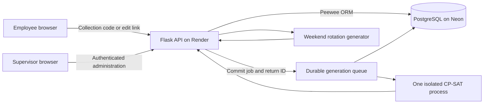

# Architecture

The Flask service serves static employee and supervisor pages and exposes JSON
endpoints. Browser code collects input, renders results, and creates weekday
Excel exports. PostgreSQL stores the application records; the browser is not
the persistence layer.

## Application boundaries

| Module / directory | Responsibility |
| --- | --- |
| `flask-app/app.py` | Routes, supervisor authentication, edits, generation, snapshots, and health endpoint |
| `flask-app/models.py` | Database selection, models, folder-scoped records, and locked additive migrations |
| `flask-app/collection_codes.py` | Code verification, response allowances, collection sessions, CSRF, history, and edit grants |
| `flask-app/solver.py` | Weekday constraints, diagnostics, staged optimization, and fairness results |
| `flask-app/generation_jobs.py`, `generation_worker.py` | Durable admission, leases, recovery, checkpoints, cancellation, and fenced schedule saves |
| `flask-app/boundary.py` | Opening/closing definitions and additional-shift permission context |
| `flask-app/weekend_generator.py` | Fixed and rotating weekend assignments |
| `flask-app/retention.py`, `request_retention.py` | Bounded cleanup under the existing 18-month policy |
| `flask-app/public/` | HTML/CSS/JavaScript for employees and supervisors |

## Persistence

Folders scope current rosters, settings, availability, codes, and schedules.
Collection codes and edit grants determine where an employee response is saved;
the supervisor's selected folder does not redirect incoming submissions.

Current availability and intake response history are distinct records. Corrections
update the linked current record and append history. Weekday snapshots retain
their original inputs/results and are reopened without rerunning the solver.
Weekend generation creates a preview that must be explicitly saved.

Initialization runs at application startup and uses serialized additive migrations.
Redeployment must keep the same database connection and stable collection keys.
Local SQLite is useful for development but cannot provide persistent hosted
storage on Render's ephemeral filesystem.

## Verification and operation

[Regression checks](../.github/workflows/regression-tests.yml) run backend,
frontend, solver, browser, and PostgreSQL tests against disposable data. The
PostgreSQL test service is local to the CI job and has no production credentials.

Render builds from `flask-app`, starts Gunicorn, and checks `/healthz`.
Four request threads handle HTTP while a separate process optimizes one weekday
schedule at a time. Health responses verify web responsiveness without database
access. Database-backed jobs survive restarts and reconnect on later visits.
See the
[application guide](../flask-app/README.md) for setup, backup/recovery, security
controls, and known limitations.
